# The Kobiton plugin for XebiaLabs XL Release product

Kobiton plugin help users to run automation test on Kobiton devices, remotely and automatically from XL release platform. Kobiton plugin can apply for uses:
- Users indie using Kobiton services
- User hosting private server
- On-Premises.

For the current version, Kobiton plugin just support executing test through tasks in a **Release** job in XL Release. 

## Featured tasks
From the plugin, we provided features to execute automation test easier:
- Get list available devices: Filter and fetch data of devices that users can access in Kobiton 
- Request execute test: Request and execute test on provided devices data and test script in Kobiton system
- Wait for execution: Fetch result and log from requested test.

## Preparation
### A. Getting Kobiton Username and API key
Kobiton Username and API key are required for authenticating with Kobiton System to executing test.

> If you don't have a Kobiton account, visit https://portal.kobiton.com/register to create one.

To get your Kobiton Username and API Key, please follow instructions at `IV. Configure Test Script for Kobiton` section on [our blog](https://kobiton.com/blog/tutorial/parallel-testing-selenium-webdriver/)

### B. Getting SSH key for private repository 

For executing test, Kobiton plugin require test script to be stored in **git** repository and Kobiton must have permission to access and clone the script to local for executing.

> Note: All of your private information such as test script, sshkey, etc. will be deleted after processing is completed. 

- **For user using test script in public repository**: Use the http link directly to the git input field (we will show in the `**request executing test** task)

- **For user using test script in private reposiotry**: Kobiton require a **ssh key** (private key) to authenticate with git.

    - The ssh key must be authenticated with git repository and it should not contain passphrase. 
    > If you do not know how to authenticate the key with git, please follow the guide from [Github create SSH key instruction](https://help.github.com/articles/generating-a-new-ssh-key-and-adding-it-to-the-ssh-agent/) and [Github adding key to account instruction](https://help.github.com/articles/adding-a-new-ssh-key-to-your-github-account/)

## Using Kobiton plugin
### A. Global configuration

1. In the XL Release home page, go to __Settings > Shared configuration > Kobiton: Server >__    

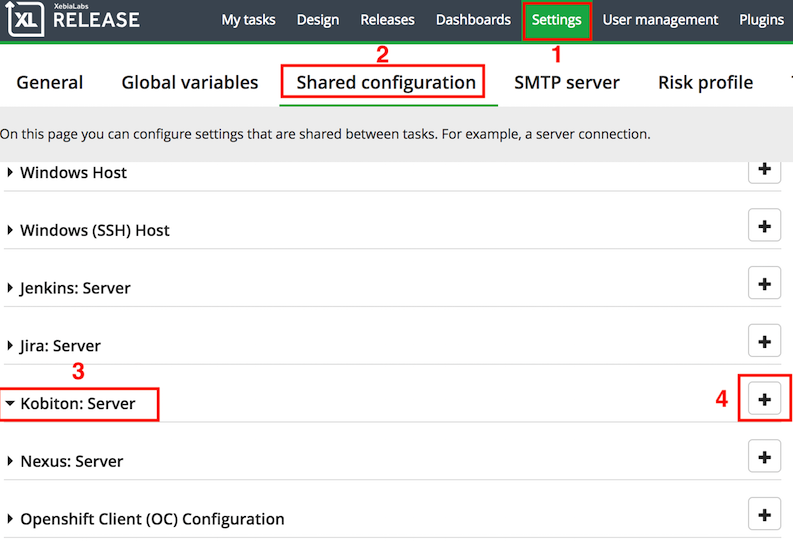

2. Fill all information to identify Kobiton servers

    |Section|Description|
    | -----------------| --------------- |
    | Title            | Enter the name of your Kobiton Server<br>Example: `Kobiton` |
    | Kobiton Username | Enter your Kobiton username |
    | Kobiton API Key  | Enter API key of your Kobiton account |
    | Kobiton API Url  | Enter the url of Kobiton Api: `https://api.kobiton.com`<br>For on premise or private hosting user, you can enter your host url here. |
    | Executor Server Url | Enter the url connect to Executor Server: `https://executor.kobiton.com`<br>For on premise or private hosting user, you can enter your host url here. |

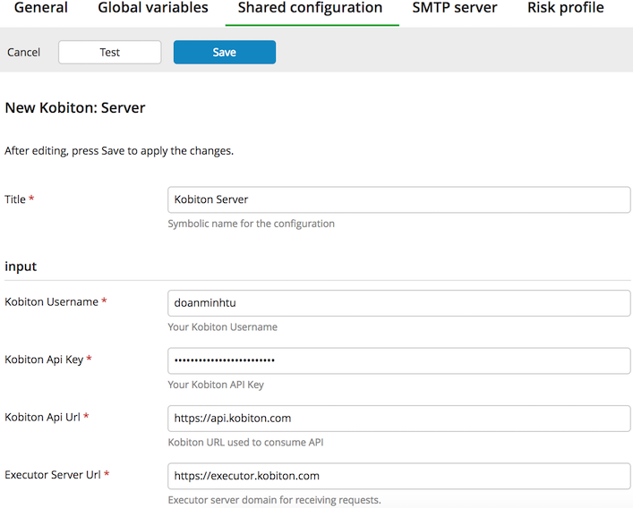

When all fills are filled as above, you can test the connection with Kobiton Server by pressing button .

3. Only if it notices `Kobiton Server is available` as below, which means all your information is correct and XL Release can connect to Kobiton. Pleas press **Save** button to apply the config. 

    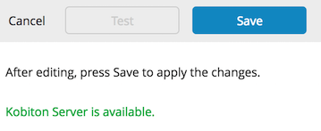

> **Note**: 
> 
> - When an error is shown that cannot connect to Api or Executor server, please make sure your information is correct and you are availble to access internet. 
>
> - If you make everything right but cannot access to Kobiton Server, please contact us for more detail.

### B. Kobiton plugin tasks

* From home page choose __> Release__. Choose any release that you want to run Kobiton pluginm, if you haven't had a release yet, choose __> New release__ to create one. 

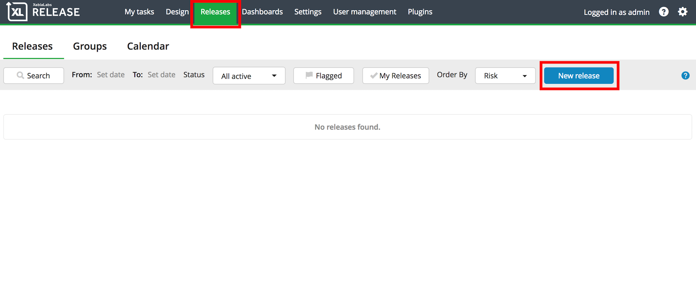

*  In each release we will see the Phrase widget in the release. Choose __> Add task > Manual > Kobiton__ and you will see all the Kobiton plugin there. 

    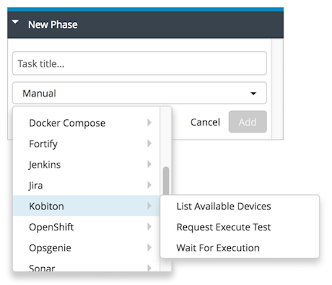

The fully detail of plugin will show in the below sessions.
Kobiton Plugin now supports 3 tasks on XL Release enviroment:

#### 1. List Available Devices
This task will help to fetch all available (online) devices data that user can access. The data can pass as environment for other tasks to be consumed. 

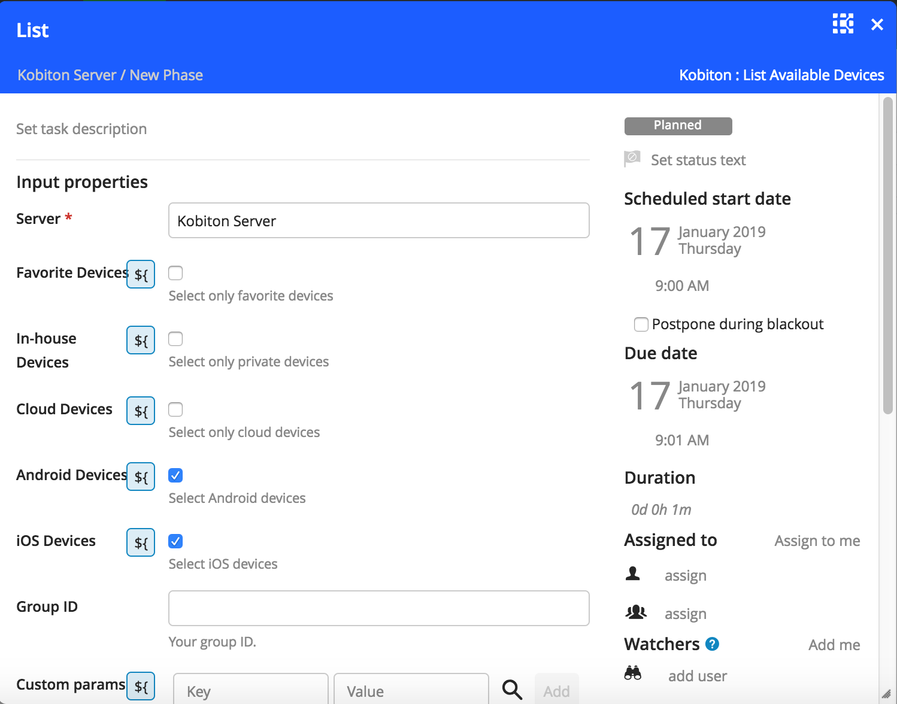

* **Input properties**:

| Field | Required | Type | Description |
| ----- | -------- | ---- |----------- |
|Favorite/In-house/Cloud Devices| Yes | Checkbox | The group containing devices that you want to use for automation test.<br> Note: You must choose at least 1 of these 3 options. |
|Android/iOS Devices| Yes | Checkbox | Mobile device OS that you want to get list. <br>Note: you must choose at least 1 of these 2 options. |
| Group Id | No | String | The ID of a specific group you want to get devices from.  For GroupID information, you can visit [Kobiton group setting](https://docs.kobiton.com//organization-management/automation-for-groups/default-group-setting/). |
| Custom Params | No | Object | Filter devices list based on params provided in [Kobiton Api docs](https://api.kobiton.com/docs/#get-all-devices) |

For more details of **Custom Params**, we can select specific devices properties such as device name, device model, device udid, etc. 
Take an example, we want to select only **Galaxy S8** devices, we can specify in the field as: 
    
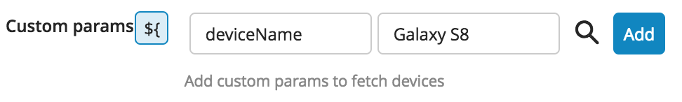

* **Output properties**: If you want to use the output from this task to the next task, you need to create a variable to save the list of devices.

> Note: please choose some specific devices by using custom params. Because the next task will pick all devices in this output to execute test one by one. 

| Step | Image | 
| ---- | ----- |
| Type in textbox the variable's name you want to save | 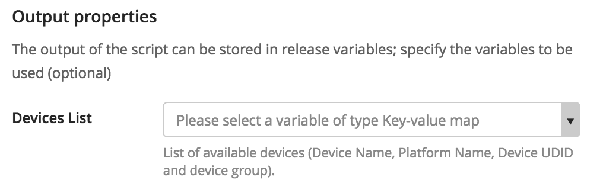 |
| Click at the row below `${} Create a new varaible of type key-value map` to create varaible |  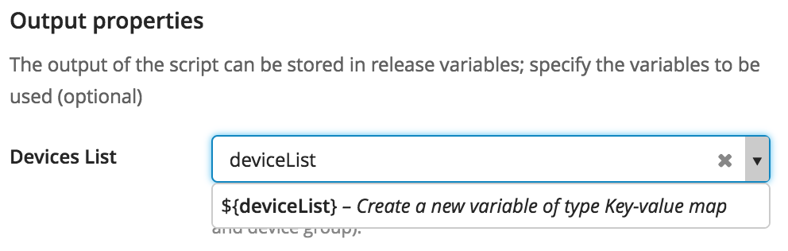 |
| Result | 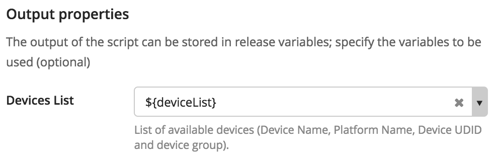 |

When properties are filled, update your task's information as your need: start date, due date, assignees, watchers, etc. 

Finally, you just close the task window, it will autosave. 
 
#### 2. Request Execute Test
This is the task used for requesting Kobiton server to execute your test. 

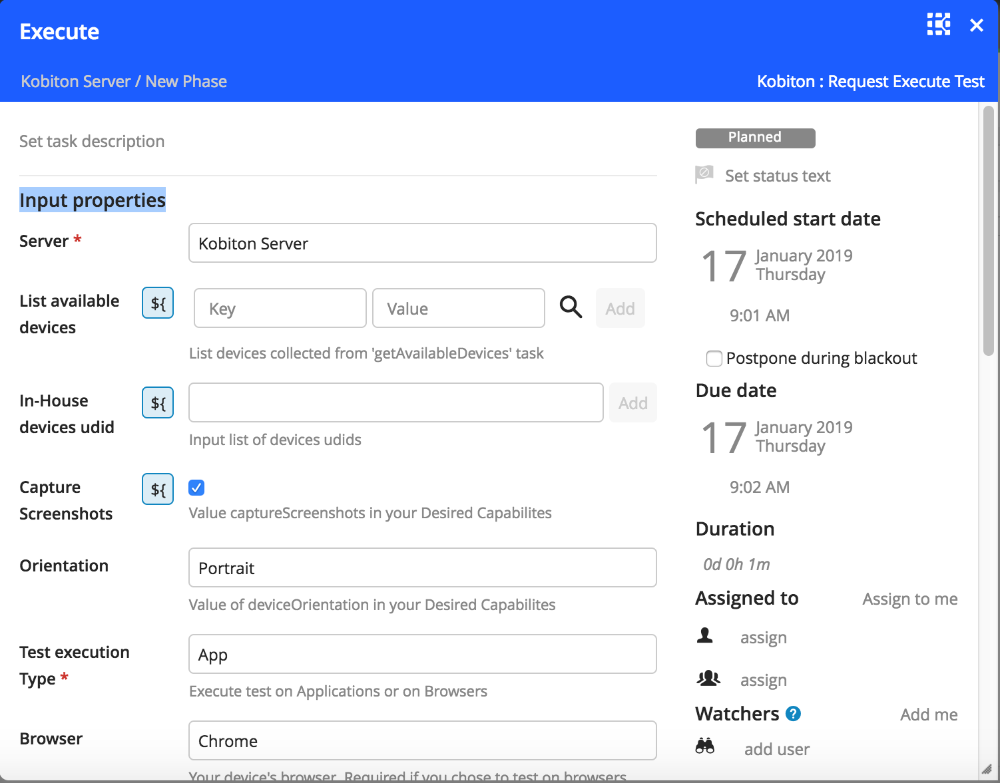

* List available devices: place the output of task 1 (if exist) to this section.

    |Step|Description|
    |----|----|
    |Click the button | 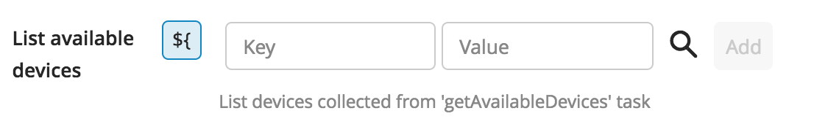 |
    |Input exactly variable you created in task 1 in the textbox |  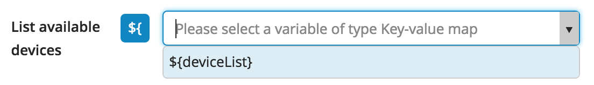 |
    |Result|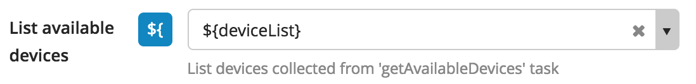|

* **Input properties:**

| Field | Required | Type | Description |
| ----- | -------- | ---- |----------- |
|In-house devices udid|No|String|The udid of your private host devices on Kobiton Desktop. Visit our [document](https://docs.kobiton.com/device-lab-management/kobiton-desktop-app/getting-started-desktop-app/) for more detail about self host devices. |
|Capture Screenshots|No|Checkbox|Screenshots will be stored on our session detail of [portal](https://portal.kobiton.com/sessions) if you select this section. |
|Orientation|Yes|Selection|Test on devices as landscape or portrait.|
|Test execution type|Yes|Selection|Execute an automation test on app or browser<br>If you choose **App**, just ignore all the config for browser and the same for the opposite|
|Browser|No|Selection|Type of browser: Chrome (android) or Safari (iOs). Required if you chose to test on browser.|
|App URL/App ID|No|String|Your app's public URL or Kobiton App ID. Required if you chose to test on apps.|
|Group ID|No|String|The ID of a specific group you want to get devices from. For GroupID information, you can visit [Kobiton group setting](https://docs.kobiton.com//organization-management/automation-for-groups/default-group-setting/).|
|Git repository|Yes|String|URL to your Git repository that contains automation test scripts.|
|Execute branch|No|String|Select the branch contain your script, default is master.<br>**Note**: You cannot choose other branch the commands fields. |
|Private repository SSH Key|Yes|String|Copy whole of file of your private SSH key and paste to this section for authenticating with git server.|
|Commands|Yes|Yaml syntax|Input commands needed to execute your test script.|

The commands yaml syntax should be:
```yaml
commands:
- The first command
- The second command
- ... 
```
> **Note:** The location for commands will be at the testscript folder that just added, so you do not need to perform command `"cd ${your-test-script}"`  to go to your test script

Example: 
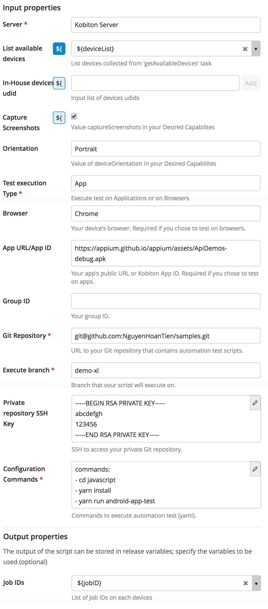

* **Output properties**: You will need to store output in a variable
for the use of getting test execution result and logs. 

| Step | Image | 
| ---- | ----- |
| Type in textbox the variable's name you want to save | 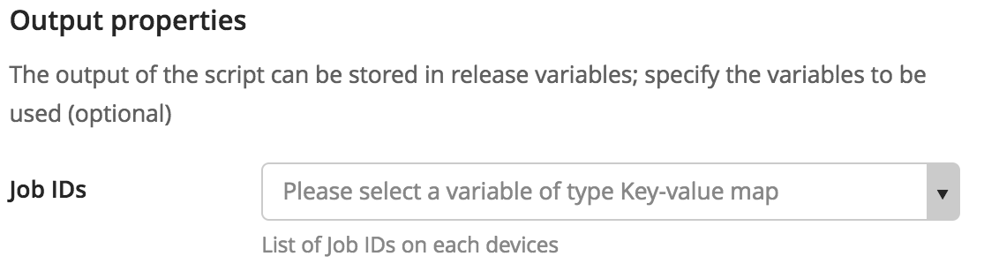 |
| Click at the row below `${} Create a new varaible of type key-value map` to create varaible |  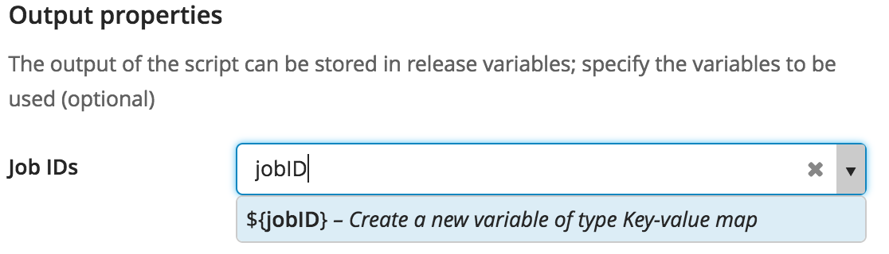 |
| Result | 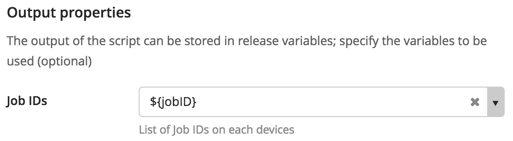 |
    

#### 3. Wait for Execution
This task will collect the result from "Request Execute test" task to let you know the automated test is pass or fail.

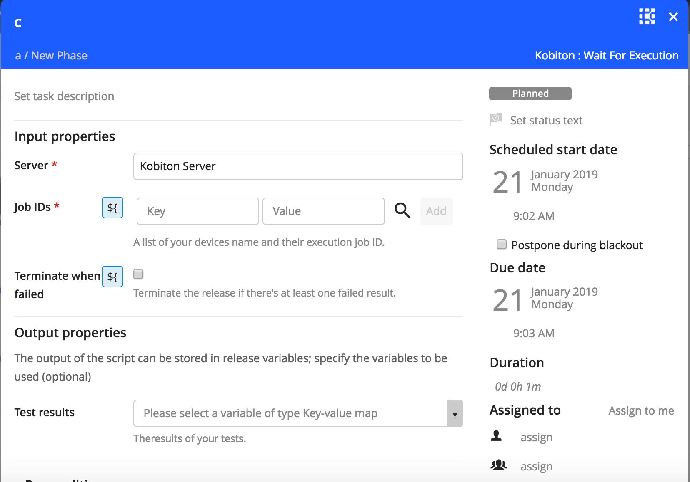

* **Input properties**

| Field | Required | Type | Description |
| ----- | -------- | ---- |----------- |
|Job IDs |Yes|Sting| Input the output variable of "Request Execute test" task |
|Terminate when failed|No|Checkbox|The release of XL will be terminated if at least 1 session failed .| 

* **Output properties**

The result of the test execution:

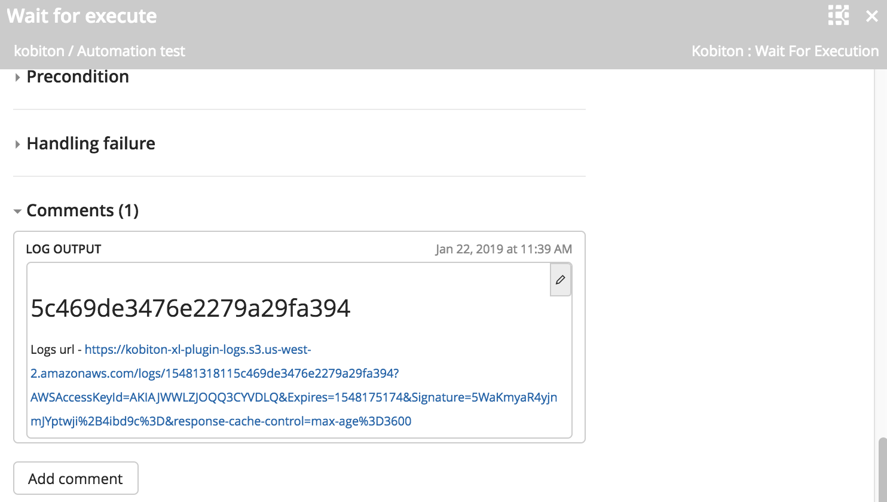

## Developer Integration guide

### Setup for development
Assume the environment is Mac OS

- Install [Homebrew](https://brew.sh/)

  - Install [Jython](http://brewformulas.org/Jython):
    ``` shell
    brew install jython
    ```

  - Install [Gradle](https://gradle.org/install/): 
    ``` shell
    brew install gradle
    ```

- Install [JDK 1.7](http://www.oracle.com/technetwork/java/javase/downloads/java-archive-downloads-javase7-521261.html)


### Executing: 
``` shell
  gradle clean build
```

- Copy the `jar` file from **build/libs** into your plugins folder.

## References

- [Kobiton](https://kobiton.com/)
- [Kobiton docs](https://docs.kobiton.com/)
- [Kobiton API docs](https://api.kobiton.com/docs/)

## Feedback

If you have any issue or further information, follow steps below to request Kobiton for support.

1. Go to https://portal.kobiton.com
2. In the navigation bar at the top of the page, click `Support`.

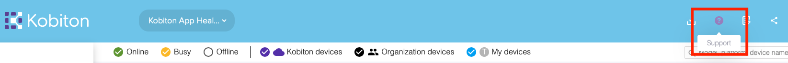

3. Fill in all necessary information and click `Submit`.

