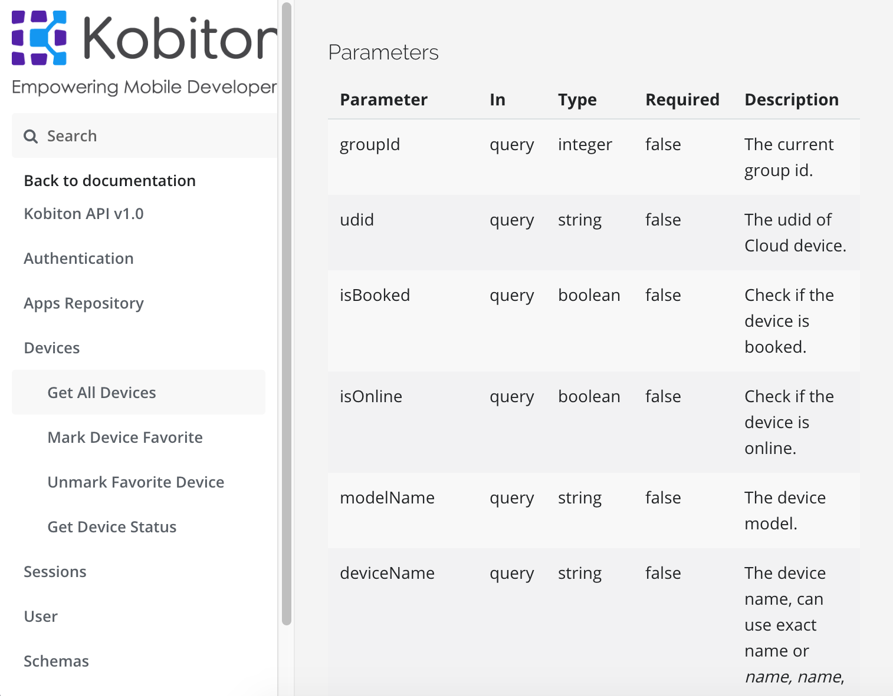
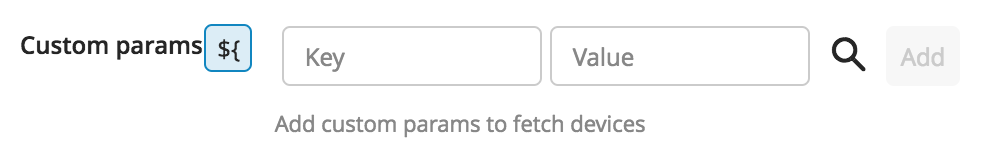
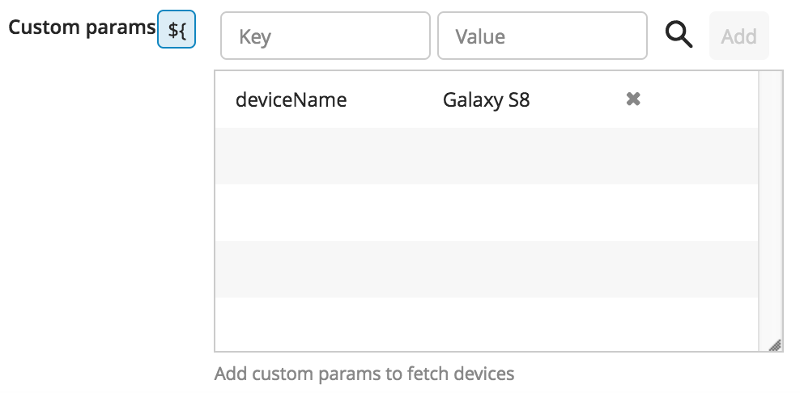
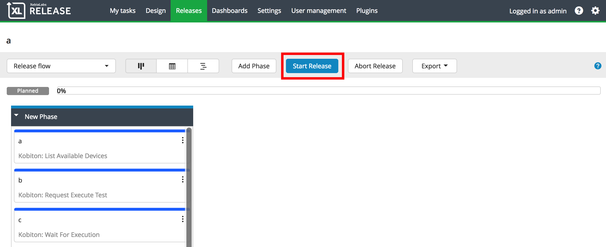
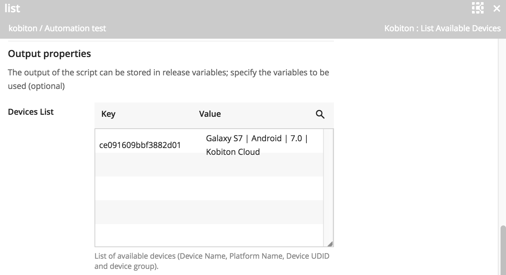
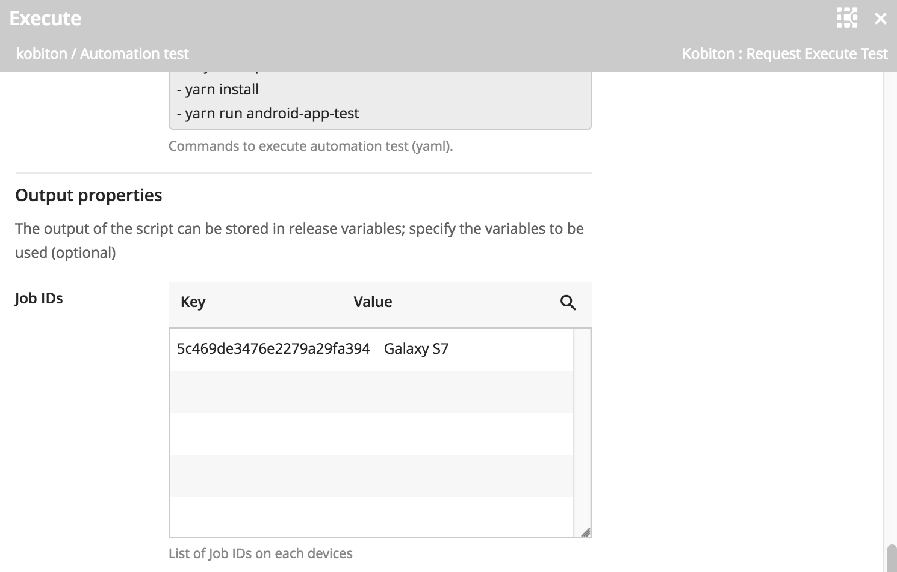
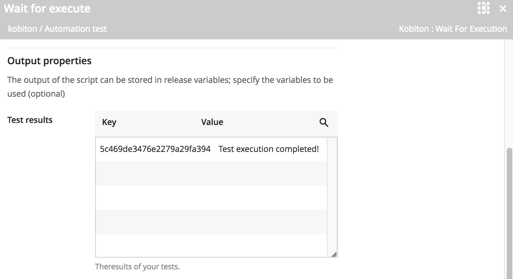

# The Kobiton plugin for XebiaLabs XL Release product

This XL release Kobiton plugin allows XL Release to interact with [Kobiton](https://portal.kobiton.com). We now support these feature tasks in order to execute automated test:
* Get list of online devices which are ready to run test.
* Execute test on devices with prepared test script.
* Collect report from test execution.

# Table of content
- [The Kobiton plugin for XebiaLabs XL Release product](#the-kobiton-plugin-for-xebialabs-xl-release-product)
- [Table of content](#table-of-content)
  - [Set up with Kobiton server](#set-up-with-kobiton-server)
    - [A. Preparation](#a-preparation)
      - [1. Getting Kobiton Username and API key](#1-getting-kobiton-username-and-api-key)
      - [2. Getting SSH key for private repository](#2-getting-ssh-key-for-private-repository)
    - [B. Configuration](#b-configuration)
  - [Set up release/phrase for Kobiton](#set-up-release-phrase-for-kobiton)
    - [A. General](#a-general)
    - [B. Task](#b-task)
      - [1. List Available Devices](#1-list-available-devices)
      - [2. Request Execute Test](#2-request-execute-test)
      - [3. Wait for Execution](#3-wait-for-execution)
  - [Start release/phrase](#start-release-phrase)
  - [Results from tasks](#results-from-tasks)
      - [1. List Available Devices](#1-list-available-devices)
      - [2. Request Execute Test](#2-request-execute-test)
      - [3. Wait for Execution](#3-wait-for-execution)
___
## Set up with Kobiton server
### A. Preparation
#### 1. Getting Kobiton Username and API key
Kobiton Username and API key are required for authenticating with Kobiton API.

> If you don't have a Kobiton account, visit https://portal.kobiton.com/register to create one.

To get your Kobiton Username and API Key, follow instructions at `IV. Configure Test Script for Kobiton` section on [our blog](https://kobiton.com/blog/tutorial/parallel-testing-selenium-webdriver/)

#### 2. Getting SSH key for private repository 
For executing automated test, Kobiton plugin supports test script stored on a Github repository. Therefore, this requires a SSH key for authenticating with your private repository on Github.

> If you haven't had SSH key yet, please visit follow [Github SSH key instruction](https://help.github.com/articles/generating-a-new-ssh-key-and-adding-it-to-the-ssh-agent/) to create one.

> Note: for security, Kobiton plugin are not support passphrase for SSH key. Please, notice this when you generate SSH key.
___
### B. Configuration

1. In the XL Release home page, go to __Settings > Shared configuration > Kobiton: Server >__    

2. These are some information you need to fill in

    |Section|Description|
    | -----------------| --------------- |
    | Title            | Enter the name of your Kobiton Server |
    | Kobiton Username | Enter your Kobiton username |
    | Kobiton Api Key  | Enter Api key of your Kobiton account |
    | Kobiton Api Url  | Enter the url of Kobiton Api: `https://api.kobiton.com` |
    | Executor Server Url | Enter the url connect to Executor Server: `https://executor.kobiton.com` |

When all fills are filled as above, you can test the connection with Kobiton Server by pressing button .

3. Only if it notices `Kobiton Server is available` as below, that means all your information is correct and XL Release is available to connect with Kobiton. Pleas press **Save** to apply. 

    

> Note: when an error is shown that cannot connect to Api or Executor server, please make sure your information is correct and you are availble to access internet. If you make everything right but cannot access to Kobiton Server, contact us for more detail.
___
## Set up release/phrase for Kobiton

### A. General 

* From home page choose __> Release__. If you haven't had a release yet, choose __> New release__ to create one. 

* When a release is created, a new phrase shown on. Choose __> Add task > Manual > Kobiton > Choose task you want to start__
    
    

### B. Task
Kobiton Plugin now supports 3 tasks on XL Release enviroment:

#### 1. List Available Devices
This task is used to get a list of available(online) devices on Kobiton environment. You can custom the task to have a specific devices-list as your requirements.

* Input properties:

    | Field | Required | Type | Description |
    | ----- | -------- | ---- |----------- |
    |Favorite/In-house/Cloud Devices| Yes | Tick box | The group containing devices that you want to use for automation test. Note: you must choose at least 1 of these 3 options. |
    |Android/iOS Devices| Yes | Tick box | Mobile device OS that you want to get list. Note: you must choose at least 1 of these 2 options. |
    | Group Id | No | String | The ID of a specific group you want to get devices from. Default, it will be "Default Group". For GroupID information, you can visit [Kobiton group setting](https://docs.kobiton.com//organization-management/automation-for-groups/default-group-setting/). |
    
* Custom Params: Kobiton Api supports to get devices list with some specific properties such as device name, device model, device udid, etc. 
    > Vist our [Api Document](https://api.kobiton.com/docs/#get-all-devices) to have information about the parameters we support. 

    * Adding a custom parameter:

    | Step | Image | 
    | ---- | ----- |
    | Visit Api document above to get the right parameter's name |  |
    | Input the parameter name in `Key` and its value |  |
    | Press `Add` to apply this properties |   |
    | Result |  |

* Output Properties: If you want to use the output from this task to the next task, you need to create a variable to save the list of devices.

    > Note: please choose some specific devices by using custom params. Because the next task will pick all devices in this output to execute test one by one. 

    | Step | Image | 
    | ---- | ----- |
    | Type in textbox the variable's name you want to save |  |
    | Click at the row below `${} Create a new varaible of type key-value map` to create varaible |   |
    | Result |  |

When properties are filled, update your task's information as your need: start date, due date, assignees, watchers, etc. 

Finally, you just close the task window, it will autosave. 
 
#### 2. Request Execute Test
This is the task used for Automated test execution. 

* List available devices: place the output of task 1 (if exist) to this section.

    |Step|Description|
    |----|----|
    |Click the button |  |
    |Input exactly variable you created in task 1 in the textbox |   |
    |Result||

* Input properties

    | Field | Required | Type | Description |
    | ----- | -------- | ---- |----------- |
    |In-house devices udid|No|String|The udid of your private host devices on Kobiton Desktop. Visit our [document](https://docs.kobiton.com/device-lab-management/kobiton-desktop-app/getting-started-desktop-app/) for more detail about self host devices. |
    |Capture Screenshots|No|Tickbox|Screenshots will be stored on our session detail of [portal](https://portal.kobiton.com/sessions) if you select this section. |
    |Orientation|Yes|Selection|Start app as landscape or portrait.|
    |Test execution type|Yes|Selection|Execute an automation test on app or browser|
    |Browser|No|Selection|Type of browser: Chrome (android) or Safari (iOs). Required if you chose to test on browser.|
    |App URL/App ID|Yes|String|Your app's public URL or Kobiton App ID. Required if you chose to test on apps.|
    |Group ID|No|String|The ID of a specific group you want to get devices from. Default, it will be "Default Group". For GroupID information, you can visit [Kobiton group setting](https://docs.kobiton.com//organization-management/automation-for-groups/default-group-setting/).|
    |Git repository|Yes|String|URL to your Git repository that contains automation test scripts.|
    |Execute branch|No|String|Select the branch contain your script because you cannot switch branch after cloning. Default branch is master.|
    |Private repository SSH Key|Yes|String|Copy whole of file of your private SSH key and paste to this section.|
    |Commands|Yes|Yaml syntax|Input commands needed to execute your test script.|

    Example: 

    

* Output properties: You will need to store output in a variable
for the use of task 3. 

    | Step | Image | 
    | ---- | ----- |
    | Type in textbox the variable's name you want to save |  |
    | Click at the row below `${} Create a new varaible of type key-value map` to create varaible |   |
    | Result |  |
    

#### 3. Wait for Execution
This task will collect the result from task 2 to let you know the automated test is pass or fail.

* Input properties

    | Field | Required | Type | Description |
    | ----- | -------- | ---- |----------- |
    |Job IDs |Yes|Sting| Input the output variable of task 2|
    |Terminate when failed|No|Tickbox|The release of XL will be terminated if at least 1 failed.| 

___ 
## Start release/phrase

When you finish editing your tasks and phrases, you can prress button **Start release** to start your release. 

___
## Results from tasks

Here are some example success output of each task:

#### 1. List Available Devices
A list of available devices will be shown here with the Key is device's udid and values are device information. If there is no device  in output, that means there is no available devices match your params at the moment. In that case, please try again later or pick another devices. 

#### 2. Request Execute Test
The output is the job id, which is used in task 3. If there is nothing in the output, please check if devices-list exists or not. Moreover, you can download the task's log in the attachment section in order to get detail information.

#### 3. Wait for Execution

After execution the test script, you will know if the test can be executed or not.

In case that the test is execute successfully, you can download the log of test report in the section **Comment**:

